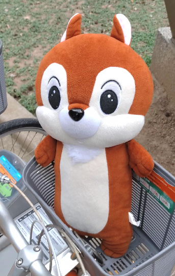
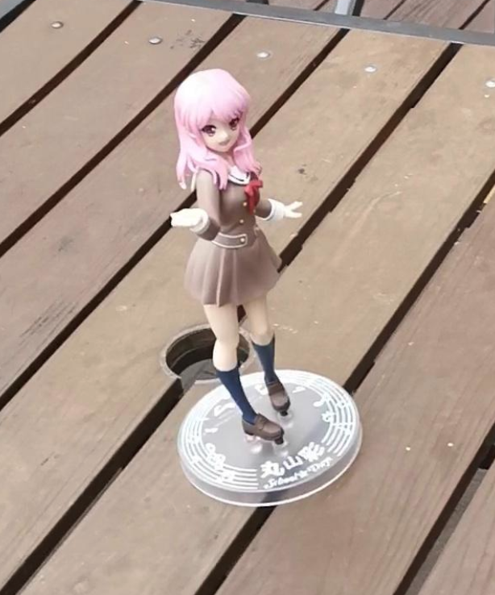

# Object Detection of Chipmunk & Pink by YoloV5


## Dataset

Our dataset contains two classes of images: chipmunk & pink.

<table cellpadding="0" cellspacing="0" width="100%">
  <tr>
    <td>Chipmunk<br /><br /></td>
    <td>Pink<br /><br /></td>
  </tr>
</table>

All images are taken by [alex10101025](https://github.com/alex10101025),
(LiaoWC)[https://github.com/LiaoWC], and [DavidLaiCS](https://github.com/DavidLaiCS) in NYCU. Selected raw data were uploaded to roboflow.com to do train-valid
split and then download as the dataset.

Number images in dataset:

|  | Chipmunk only | Pink only | Both | Total |
| --- | --- | --- | --- | --- |
| training | 108 | 143 | 120 | 371 |
| validation | 2 | 7 | 1 | 10 |
| Total | 110 | 150 | 121 | 381 |

## Prepare


1. Clone yolov5 repo from https://github.com/ultralytics/yolov5 and install require packages based on its instruction
2. Download
   - [Dataset (train & valid)](https://drive.google.com/file/d/1AaBS7qI-MD2LQbjgsgV8c-lK7D_b8Sv1/view?usp=sharing)
   - [Test videos](https://drive.google.com/file/d/1JsEGN3dKEO1CRtmXeknISd8V1ysdc3xb/view?usp=sharing)
   - [Pretrained model (epoch 360)](https://drive.google.com/file/d/1Ib3Ukr1l5i5mKCj4GISs93c3uWXwxgzj/view?usp=sharing)
3. Copy hyper-parameter config files:
   - Copy "chipmunk_pink.yaml" to "yolov5/data/"
   - Copy "hyp.scratch_chipmunk_pink.yaml" to "yolov5/data/hyps/"
   - Copy "yolov5x-chipmunk_pink.yaml" to "yolov5/models/"
   - Unzip dataset.zip and put it in "yolov5/"
   - Put "epoch360.pt" in "yolov5/"
   - Unzip test_videos.zip and put it in "yolov5/"

## Detect

In the following commands, you can try to add "-h" to get more details of arguments. 

```shell
cd yolov5/
# To reproduce the detect videos, set: iou-thres=0.4, conf-thres=0.6, imgsz=256
python3 detect.py --source test_videos/raw/both_test_2.mp4 --weights epoch360.pt --imgsz 256 --conf-thres 0.6 --iou-thres 0.4 --device 0 
```

## Train

```shell
# Train from pretrained yolov5x.pt
bash data/scripts/download_weights.sh  # Get yolov5's pretrained models
python3 train.py --data chipmunk_pink.yaml --weights yolov5x.pt  --hyp hyp.scratch_chipmunk_pink.yaml --adam --save-period 10 --cfg yolov5x-chipmunk_pink.yaml --device 0 --bbox_interval 5  --imgsz 256 --batch-size 16 --epochs 1000
```


